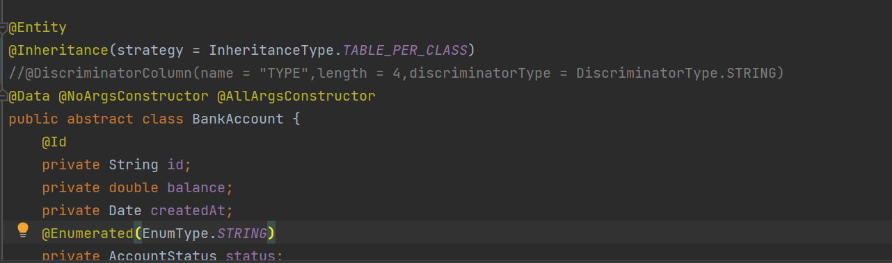
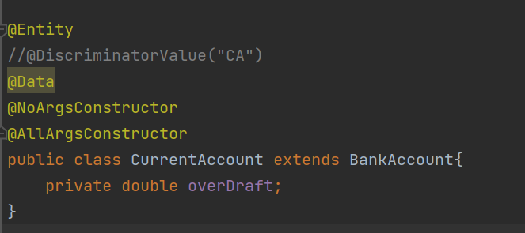
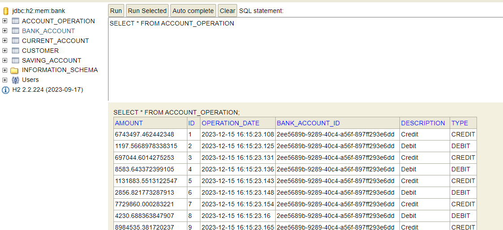

<h1>Spring Angular Spring Security JWT : E-Banking</h1>
<h2>Introduction</h2>

L'objectif est de développer une application de gestion de comptes bancaires en trois étapes clés. La première consiste à créer la couche DAO avec Spring Boot, la deuxième à concevoir l'interface utilisateur avec Angular, et la troisième à assurer la sécurité via Spring Security et les JSON Web Tokens.

L'application permettra la gestion complète des comptes bancaires, avec deux types distincts : courants et épargnes.

<h2>Conception:</h2>

<h2>Partie 1 : Couche DAO et Service</h2>

<h3>Création du Projet Spring Boot:</h3>

La phase inaugurale de notre projet requiert l'établissement de l'environnement de 
développement par le biais de la création d'un projet Spring Boot. Reconnu pour son infrastructure rationalisée, 
Spring Boot facilite le développement d'applications Java en autorisant une configuration expéditive et une gestion 
fluide des dépendances.

<h3>Création des entités JPA : Customer, BankAccount, Saving Account, CurrentAccount, AccountOperation:</h3>

Une fois le projet Spring Boot établi, l'étape cruciale suivante réside dans la création des entités JPA (Java Persistence API). Ces entités, comprenant Customer, BankAccount, Saving Account, CurrentAccount et AccountOperation, dictent 
la structure des données maniées par l'application. Chaque entité constitue une table dans la base de données, et 
les relations qui les lient reflètent la logique métier inhérente au système bancaire.

<h3>Création des interfaces JPA Repository basées sur Spring Data:</h3>

Les interfaces JPA Repository, s'appuyant sur Spring Data, revêtent 
une importance cruciale en facilitant l'accès aux données. En définissant ces interfaces, 
nous exploitons la puissance de Spring Data pour générer automatiquement les requêtes SQL requises 
pour les opérations CRUD (Create, Read, Update, Delete). Cette approche simplifie significativement 
la couche DAO en éliminant la nécessité de rédiger manuellement des requêtes SQL.

<h3>Mapping Héritage:</h3>

Dans ce projet nous allons essayer les 3 strategies à noter le Single Table , Table Per class et Joined

<h4>Stratégie "Single Table":</h4>

CurentAccount entitie

SavingAccount entitie

BankAccount entitie

Simulation H2database : all customers

Simulation H2database : Bank_Account Customer 

Simulation H2database : Account_Operation Customer 

<h4>Stratégie "Table Per Class":</h4>

CurentAccount entitie

SavingAccount entitie

BankAccount entitie

<h4>Stratégie "Joined":</h4>

CurentAccount entitie

SavingAccount entitie

BankAccount entitie

<h3>Consultation d'un customer:</h3>

<h3>Basculement vers MySQL en utilisant la stratégie "Single Table":</h3>

<h3>Affichage des customers sous format json:</h3>

